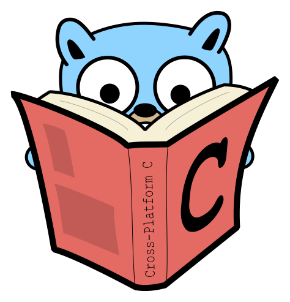

# Mike Hacker

- [Sr. Software Engineer CV](https://sr-software-engineer-cv.vercel.app/)
- [StackOverflow](https://stackoverflow.com/users/4612518/bananaforscale)

## Professional Experience

### Full-Time Experience
- Sr. Software Engineer [GKE, Go, Ruby, Py] - WP Engine, Austin, TX (Remote) (2022-24)
- Sr. Software Engineer [AZ, Java, C#] - FIMC, Madison, WI (Remote) (2020-22)
- Sr. Software Engineer [AWS, NodeJS, PHP] - Pizza Hut Digital Ventures, London, UK (Remote) (2019)
- Sr. Software Engineer [AWS, Py, C#] - (AWS GovCloud) Tyler Technologies, Yarmouth, ME (Remote) (2017-18)
- Full-Stack Developer [NodeJS] - TxDOT, Austin, TX (2016)
- Web Development Immersive [Ruby, NodeJS] - General Assembly, Austin, TX (2015)
    
### Education
- University of North Texas (2010-2014) [BAAS - Economics]
- Collin County Community College (1998-2000) [AS - Finance]

### Research
- [IaaS](https://github.com/bfsio/inf-svc)

# Go with C

<!--
**mhackersu/mhackersu** is a ✨ _special_ ✨ repository because its `README.md` (this file) appears on your GitHub profile.

Here are some ideas to get you started:

- 🔭 I’m currently working on ...
- 🌱 I’m currently learning ...
- 👯 I’m looking to collaborate on ...
- 🤔 I’m looking for help with ...
- 💬 Ask me about ...
- 📫 How to reach me: ...
- 😄 Pronouns: ...
- ⚡ Fun fact: ...

-->
